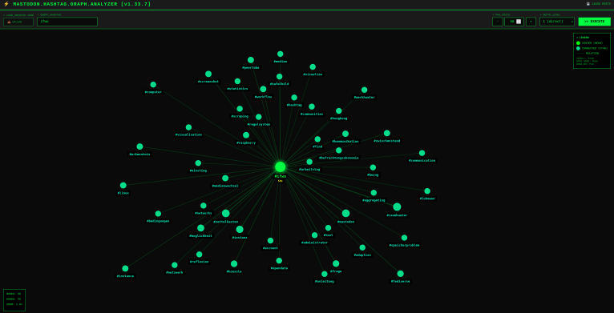

# Mastodon Hashtag Visualizer

Interaktives Visualisierungs-Tool zur Analyse der Verbindungen eines bestimmten Hashtags aus einem Mastodon-Archiv.

## Screenshot

## Features

- **Visueller Netzwerk-Graph**: Zeigt Hashtags als vernetzte Knoten mit physikbasiertem Layout
- **Konfigurierbare Analyse**:
  - Suche nach spezifischen Hashtags
  - Steuerung der Anzahl analysierter Posts (MAX_POSTS)
  - Umschaltung zwischen direkten Verbindungen (Tiefe 1) oder erweiterten Netzwerken (Tiefe 2)
- **Interaktive Steuerung**:
  - Zoom: Mausrad
  - Verschieben: Klicken und Ziehen des Hintergrunds
  - Knoten bewegen: Klicken und Ziehen einzelner Knoten
- **Hacker-Style**: Neon-grün/cyan Farbschema mit Terminal-Ästhetik

## Verwendung

1. **Mastodon-Archiv exportieren** (Einstellungen → Export → Archiv anfordern)
2. **Öffne** `mastodon-graph.html` in einem Browser
3. **Lade** deine `outbox.json` Datei hoch
4. **Gib einen Hashtag ein** (ohne #) zur Analyse
5. **Passe MAX_POSTS an** um zu steuern, wie viele verbundene Hashtags angezeigt werden
6. **Klicke EXECUTE** um die Visualisierung zu generieren

## Technische Details

- Standalone HTML-Datei - keine Installation erforderlich
- Läuft vollständig im Browser (client-side)
- Verwendet physikbasierte Graph-Darstellung mit Kollisionsvermeidung
- Minimaler Knoten-Abstand: 180px für optimale Lesbarkeit

## Anwendungsfall

Perfekt zur Analyse von persönlichen Wissensmanagementsystemen auf Mastodon, zum Erkunden konzeptueller Verbindungen und zum Entdecken von Mustern in langfristiger Hashtag-Nutzung (Zettelkasten-artige Notizen).

## Lizenz

GPL-3.0

## Autor

Michael Karbacher
